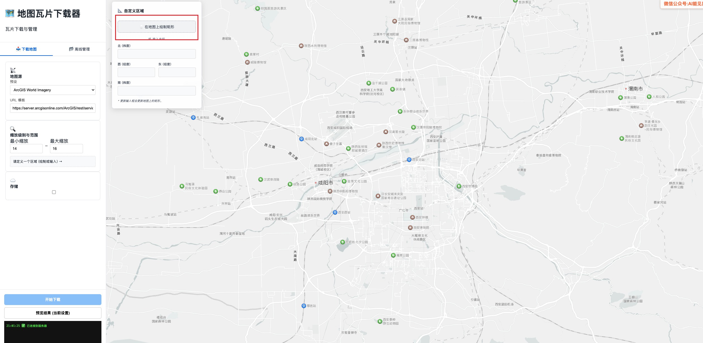

# 🗺️ 离线地图瓦片下载器

一个功能完整的离线地图瓦片下载和管理系统，支持多种地图源、区域选择、MinIO云存储集成以及下载管理。



## 🌟 特性

- **多种地图源支持**：Google Maps、天地图、ArcGIS、CartoDB等
- **智能区域选择**：通过中国行政区域选择或手动绘制矩形区域
- **灵活缩放级别**：自定义下载的最小/最大缩放级别
- **MinIO集成**：直接上传到MinIO对象存储
- **下载管理**：查看、预览、打包和删除历史下载记录
- **实时日志**：通过WebSocket实时显示下载进度
- **离线预览**：使用Leaflet预览已下载的地图瓦片

## 🏗️ 技术栈

### 前端 (my-tiler-ui)
- Vue 3 + TypeScript
- Vite 构建工具
- Element Plus UI 组件库
- 高德地图 API (AMap) 用于区域选择
- Leaflet 用于地图预览
- Socket.IO 实现实时通信

### 后端 (node-tiler-api)
- Node.js + Express
- SQLite 数据库存储下载记录
- MinIO SDK 用于云存储
- Axios 用于HTTP请求
- Socket.IO 实现实时通信

## 🚀 快速开始

### 环境要求
- Node.js >= 20.19.0
- npm 或 yarn

### 安装

#### 1. 启动后端服务

```bash
# 进入后端目录
cd node-tiler-api

# 安装依赖
npm install

# 启动服务
node server.ts
```

后端服务将运行在 `http://localhost:8000`

#### 2. 启动前端界面

```bash
# 进入前端目录
cd my-tiler-ui

# 安装依赖
npm install

# 启动开发服务器
npm run dev
```

前端界面将运行在 `http://localhost:5173`

## 📖 使用指南

https://www.bilibili.com/video/BV1k46oBaEXy/?share_source=copy_web&vd_source=72aa4f31238972662733e2bba889a0c9  


### 1. 选择地图源
在左侧控制面板中选择预设的地图源，或自定义URL模板。

### 2. 设置区域
- **通过行政区域选择**：使用高德地图API选择省市区
- **手动绘制**：在地图上绘制矩形区域
- **手动输入坐标**：直接输入北、南、西、东边界坐标

### 3. 配置下载参数
- 设置最小/最大缩放级别
- 配置MinIO存储（可选）

### 4. 开始下载
点击"开始下载"按钮启动下载任务，实时日志将显示下载进度。

### 5. 管理下载
切换到"离线管理"标签页查看历史下载记录，可以预览、打包下载或删除记录。

## ⚙️ 配置说明

### 地图源预设
- Google Maps (卫星图/标准图)
- 天地图 (需要API密钥)
- ArcGIS World Imagery
- CartoDB

### MinIO配置
如果需要将下载的瓦片直接上传到MinIO，请提供以下信息：
- 端点地址
- 端口号
- 访问密钥
- 私密密钥
- 存储桶名称
- SSL设置

## 📁 项目结构

```
.
├── my-tiler-ui/           # 前端Vue应用
│   ├── src/
│   │   └── App.vue        # 主应用组件
│   ├── public/            # 静态资源
│   └── package.json       # 前端依赖
├── node-tiler-api/        # 后端Node.js服务
│   ├── server.ts          # 主服务文件
│   ├── database.ts        # 数据库操作
│   ├── db/                # SQLite数据库文件
│   └── output/            # 下载的瓦片文件
├── doc/                   # 文档和截图
└── README.md              # 项目说明文档
```

## 🔧 开发指南

### 前端开发

```bash
# 安装依赖
npm install

# 启动开发服务器
npm run dev

# 构建生产版本
npm run build

# 预览生产构建
npm run preview
```

### 后端开发

```bash
# 安装依赖
npm install

# 启动服务
node server.ts
```

## 📞 API 接口

| 接口 | 方法 | 描述 |
|------|------|------|
| `/api/download` | POST | 启动下载任务 |
| `/api/cancel` | POST | 取消当前下载任务 |
| `/api/downloads` | GET | 获取下载记录列表 |
| `/api/downloads/:id` | DELETE | 删除下载记录 |
| `/api/downloads/package` | POST | 打包下载多个记录 |

## 📃 许证证

本项目采用 Apache License 2.0 许可证。详情请见 [LICENSE](LICENSE) 文件。

## 🤝 贡献

欢迎提交 Issue 和 Pull Request 来改进这个项目。

## 📧 联系方式

如有问题，请联系项目维护者。

